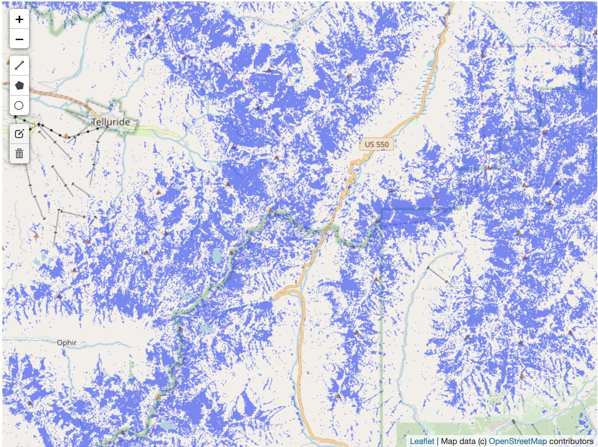

# gee-python-snowmelt
exploring radar wet snow maps with google earth engine python api

## To run:

### Get an account with google earth engine and initialize access with a token. See here:
https://github.com/google/earthengine-api/blob/master/python/examples/ipynb/authorize_notebook_server.ipynb

### Launch Pangeo Binder:

